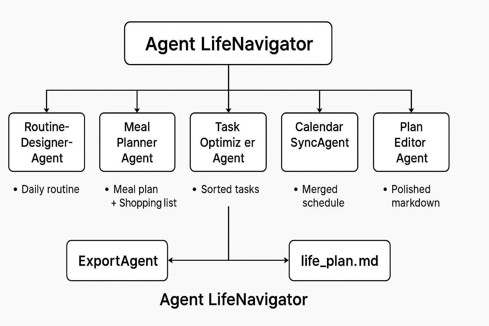

# Project Overview – Agent LifeNavigator



NOTE: This project is structured in the style of the Agent Shutton Kaggle Capstone submission.  
This README contains the **complete project explanation**, including Problem Statement, Solution, Architecture, Workflow, LLM Integration, Installation, Value, and Conclusion.

---

# Problem Statement

Weekly life planning is exhausting and extremely repetitive. People struggle with:
- Building daily routines  
- Planning meals  
- Managing tasks  
- Scheduling time blocks  
- Maintaining healthy habits  
- Keeping calendars updated  

Even with modern apps, **95% of planning is still manual**, causing:
- Decision fatigue  
- Loss of productivity  
- Stress from poor organization  
- Inconsistent habits  
- Fragmented workflows across multiple apps  

People need **automation**, not more tools to manage.  
Agent LifeNavigator solves this by generating a complete weekly plan automatically.

---

# Solution Statement

**Agent LifeNavigator** is a multi-agent AI system that automates the entire planning workflow:

- 🕒 Creates personalized daily routines  
- 🍽️ Generates a 7‑day meal plan  
- 🛒 Builds a grocery shopping list  
- 📄 Prioritizes tasks  
- 📅 Merges user events into a master schedule  
- 📘 Exports a fully‑formatted `life_plan.md`  

It uses a **pipeline of specialized agents**, coordinated by an OrchestratorAgent.

---

# Architecture

## Architecture Diagram


---

## Architecture Explanation

### **OrchestratorAgent – Central Brain**
Coordinates all subprocesses:
1. Loads memory  
2. Runs routine generator  
3. Runs meal planner  
4. Optimizes tasks  
5. Merges calendar  
6. Builds markdown  
7. Applies editing  
8. Exports final file  

---

### **RoutineDesignerAgent**
Uses wake time, sleep time, work schedule, fitness habits, skincare preferences, and learning goals to generate:
- Morning routine  
- Work blocks  
- Gym time  
- Skincare  
- Learning blocks  
- Night wind‑down  

---

### **MealPlannerAgent**
Builds:
- 7-day meal plan  
- Consolidated shopping list  

Powered by:
- Diet type  
- Budget  
- Ingredient restrictions  
- Nutrition heuristics  

---

### **TaskOptimizerAgent**
Sorts tasks using:
- Priority  
- Urgency  
- Execution difficulty  
- Time availability  

---

### **CalendarSyncAgent**
Combines:
- Routine blocks  
- Meal blocks  
- Predefined events  
- Work schedule  

Designed for future:
- Google Calendar API  
- Apple Calendar  
- Outlook Calendar  

---

### **PlanEditorAgent**
Cleans formatting, improves structure, and turns the weekly data into a polished Markdown file.

---

### **ExportAgent**
Exports everything into:

```
life_plan.md
```

---

# LLM Integration (Gemini 2.0 / 2.5 Pro)

Agent LifeNavigator uses:

### ✅ **Gemini 2.0 Flash / Gemini 2.5 Pro** for:
- Reasoning  
- Plan generation  
- Meal descriptions  
- Task optimization  
- Editing  

### All LLM calls are handled safely:
- No API keys stored in code  
- Environment variable loading  
- Error-safe fallbacks  

---

# Project Structure

```
agent-lifenavigator/
│
├── agents.py                 # All agent classes + orchestrator
├── tools.py                  # Tools: meal planner, exporter, calendar reader
├── memory.py                 # Stored user preferences
├── validation.py             # Data validators
├── main.py                   # Pipeline entry point
│
├── config.py                 # Central configuration (LLM settings, model names, paths)
├── gemini_agent.py           # Gemini 2.0 / 2.5 Pro wrapper for generating LLM responses
├── personality_engine.py     # Personality + style customization for personalized plans
├── user_input.py             # Handles user interactions, input prompts, validation
│
├── README.md                 # Full project documentation
├── life_plan.md              # Generated weekly plan output
└── preferences.json          # Auto-updated memory storing user preferences

```

---

# Workflow (Step-by-Step)

```
User Input
    ↓
Memory Save
    ↓
RoutineDesignerAgent → Build routine
    ↓
MealPlannerAgent → Weekly meal plan + shopping list
    ↓
TaskOptimizerAgent → Sorted tasks
    ↓
CalendarSyncAgent → Merge schedules
    ↓
PlanEditorAgent → Clean Markdown
    ↓
ExportAgent → Save life_plan.md
```

---

# Installation & Running

Follow these steps to install and run **Agent LifeNavigator**.

## 1. Clone the Repository

```bash
git clone https://github.com/<your-username>/agent-lifenavigator.git
cd agent-lifenavigator
```

## 2. (Optional) Create a Virtual Environment

### macOS / Linux
```bash
python3 -m venv .venv
source .venv/bin/activate
```

### Windows (CMD)
```cmd
python -m venv .venv
.venv\Scripts\activate
```

### Windows (PowerShell)
```powershell
python -m venv .venv
.venv\Scripts\Activate.ps1
```

---

## 3. Install Dependencies

```bash
pip install -r requirements.txt
```

---

## 4. Set Your Gemini API Key

```bash
export GEMINI_API_KEY="your_key_here"
```

Windows:
```cmd
set GEMINI_API_KEY=your_key_here
```

---

## 5. Run the Agent

```bash
python main.py
```

Your personalized plan will be created as:

```
life_plan.md
```

---

## 6. Reset Memory (Optional)

```bash
rm preferences.json
```

---

# 🎯 Execution Steps

When running:
```
python main.py
```

You will see:

```
=== Agent LifeNavigator ===
1) Load profile.json
2) Enter new profile manually
3) Use default profile

Select option (1/2/3):
```

Select:
- **2** to enter new profile  
- **1** to load existing profile  
- **3** for default  

Then input your details.

Output saved as:
```
life_plan.md
```

---

# Value Statement

Agent LifeNavigator reduces weekly planning time by **8–12 hours**, helping users:
- Remove mental burden  
- Maintain healthy routines  
- Stay consistent  
- Improve productivity  
- Reduce stress  
- Organize life effortlessly  

Future upgrades:
- Real calendar integration  
- Smart habit tracking  
- Personalized fitness agent  
- Nutrition + macro tracking  
- Travel planning  
- Financial planning agent  

---

# Conclusion

Agent LifeNavigator is a complete demonstration of multi-agent automation applied to real life.  
With Gemini-powered reasoning and modular agents, it delivers a seamless weekly plan with minimal user input.

This project fits perfectly into the **Concierge Agent Track** and showcases how AI can meaningfully enhance everyday life.

